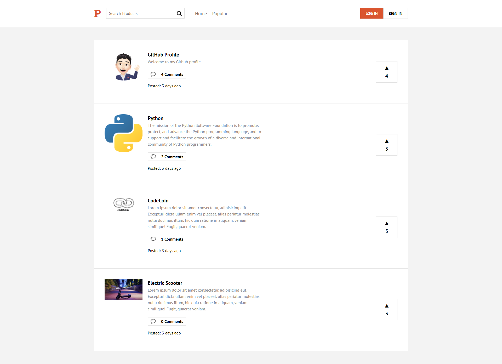
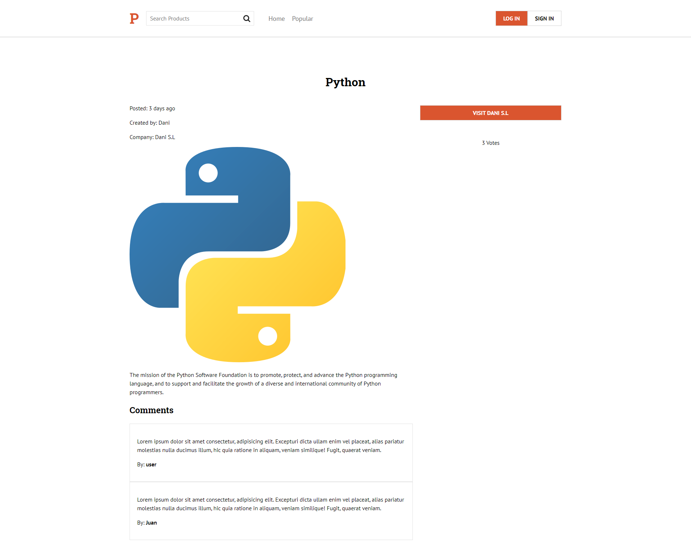
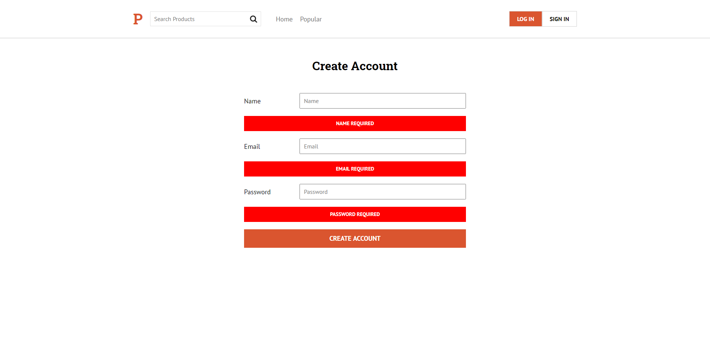
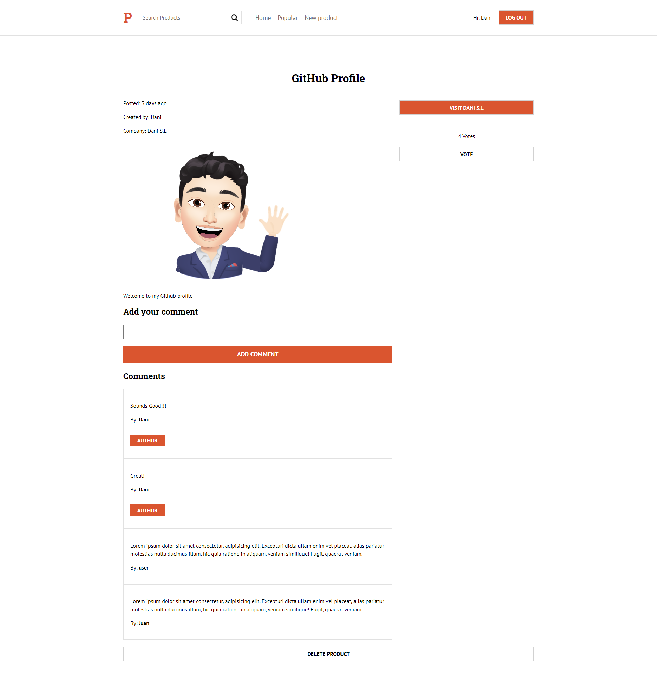

<p align="center">

</p>

# product-hunt-clone
Welcome to Product Hunt Clone.

## Built With

### Front-end

* [React](https://reactjs.org/)
* [Next.js](https://reactjs.org/)
* [Firebase](https://firebase.google.com/)
* [Emotion](https://emotion.sh/)


## What is Product Hunt?

Product Hunt is a place for product-loving enthusiasts to share and geek out about the latest mobile apps, websites, hardware projects, and tech creations.

* [Product Hunt](https://www.producthunt.com/)

In this project, I have created a full website with features including users register and log-in, creation of new products, comments, votes, search and popular products.

* [Product Hunt Clone](https://product-hunt-be03f.web.app/)

## Getting Started

### Prerequisites

For this project you need:

```
Nodejs
```

### Installing

Go to product-hunt-clone/product-hunt and run:

```
npm install
```
Create a Firebase account and a new database:

* [Firebase](https://firebase.google.com/)

Add your DB details to product-hunt-clone/product-hunt/firebase/config.js

## Running React

In the folder product-hunt-clone/product-hunt run:

```
npm start
```

Now you can use Product Hunt Cole!


## Result

### Before Sign In

You can Sign In if you would like to create new products, comment or vote. Check out the products in the view mode without Sign In.

* Product Hunt View Mode



* Products View Mode




### Sign In

* Sign In



### User Product Hunt

* Product Hunt



